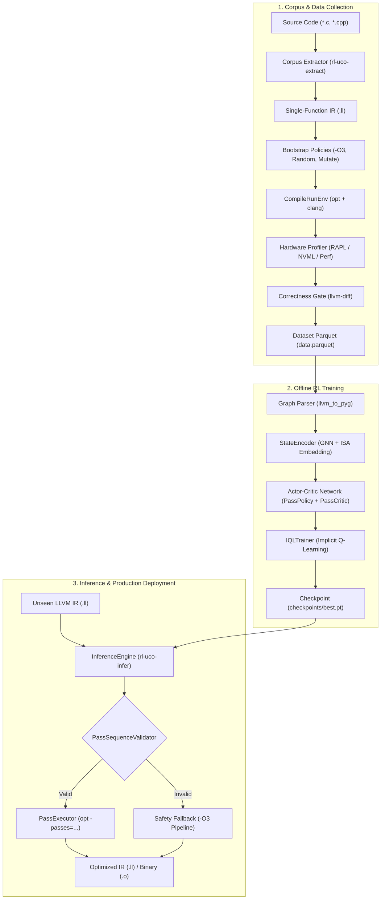

<div align="center">

# ⚡ `rl-uco`
### Offline Reinforcement Learning for Universal Compiler Optimization Across ISAs

**Learn optimal compiler pass sequences from execution traces — without compiler-in-the-loop latency.**

[](https://github.com/FreakyAdy/RL-for-Universal-Compiler-Optimization/actions/workflows/ci.yml)
[-brightgreen.svg)](tests/)
[](https://python.org)
[](https://llvm.org/)
[](LICENSE)
[](CONTRIBUTING.md)

<p align="center">
  <a href="#-quick-demo">⚡ Quick Demo</a> •
  <a href="#-why-rl-uco">💡 Why RL-UCO</a> •
  <a href="#️-system-architecture">🏗️ Architecture</a> •
  <a href="#-hardware-profiling--cross-isa-support">🎯 Hardware & ISAs</a> •
  <a href="#-quick-start">🚀 Quick Start</a> •
  <a href="#-pipeline-workflow">🔄 Pipeline</a> •
  <a href="#️-ecosystem-comparison">⚖️ Ecosystem</a> •
  <a href="#-contributing">🤝 Contributing</a>
</p>

> **🔬 Research Framework** — RL-UCO decouples compiler pass selection from interactive online environments. Rather than invoking `opt` and physical microbenchmarks inside the inner training loop, it uses **Implicit Q-Learning (IQL)** over static execution logs (`data.parquet`) with learned Graph Neural Network (GNN) and ISA conditioning.

</div>

---

## ⚡ Quick Demo

Run the end-to-end pipeline in under 15 seconds — synthetic corpus generation, Parquet dataset export, GNN state encoding, IQL training, and pass sequence inference (**no external LLVM installation required**):

```bash
python scripts/demo.py
```

```text
============================================================
Step 1/3: Generating synthetic corpus...
============================================================
  Created 20 synthetic functions

============================================================
Step 2/3: Building dataset and training IQL agent...
============================================================
  Wrote 20 rows to data/datasets/demo_v1/data.parquet
  epoch 1/10: loss=1.1248
  epoch 2/10: loss=0.7478
  epoch 5/10: loss=0.1016
  epoch 10/10: loss=0.0091
  Saved checkpoint: checkpoints/best.pt

============================================================
Step 3/3: Running inference on a sample function...
============================================================
  Input:  fn.ll
  Proposed pass sequence (12 passes): ['instcombine', 'instcombine', 'gvn', ...]
  Pipeline string: instcombine,instcombine,gvn,gvn,gvn,gvn,gvn,gvn,gvn,gvn,gvn,gvn

[OK] Demo complete!
```

---

## 💡 Why RL-UCO?

Modern compilers (LLVM, GCC) rely on static heuristics like `-O2` and `-O3` with fixed pass ordering. While general-purpose, fixed pipelines miss significant function-specific and hardware-specific optimization opportunities.

Prior machine learning approaches formulated pass ordering as an **interactive online Gym** (e.g., CompilerGym). While conceptually appealing, interactive compiler environments introduce severe operational barriers:

| Dimension | Standard Heuristics (`-O3`) | Interactive Gyms (e.g. CompilerGym) | ⚡ **RL-UCO (Offline IQL)** |
| :--- | :--- | :--- | :--- |
| **Pass Ordering** | Fixed, static sequence | Step-by-step online agent search | **Learned context-aware policy** |
| **Training Speed** | N/A (no training) | Extremely slow (compiler in gradient loop) | **Fast GPU/CPU training over static logs** |
| **Toolchain Stability** | High | Brittle (compiler crashes halt training) | **100% decoupled (pre-filtered clean logs)** |
| **Objective** | Instruction count heuristic | Execution time or code size | **Multi-objective (Wall-time + Energy)** |
| **Target Architecture** | Generic tuning per target | Single host CPU | **Cross-ISA conditioned (x86, ARM, CUDA)** |
| **Deployment Safety** | Guaranteed | Unpredictable (crash risk) | **Correctness gate with auto -O3 fallback** |

### Core Design Principles

1. **Offline Reinforcement Learning (IQL):** Data collection happens once. Exploration traces (random passes, -O3 seeds, pass mutations) are logged with physical runtime and energy metrics. Training uses Implicit Q-Learning over logged transitions without executing compilers during gradient descent.
2. **Joint Time & Energy Optimization:** Rewards are computed directly from real hardware interfaces (Intel RAPL energy on x86, NVML on NVIDIA GPUs, perf on ARM).
3. **Graph + ISA Conditioning:** Program representations combine LLVM IR control/data-flow graphs with target ISA embeddings (`x86_64_v3`, `aarch64`, `cuda_sm80`), enabling a single model to specialize across hardware.
4. **Guaranteed Verification Gate:** Proposed pass sequences undergo functional equivalence checking via `llvm-diff` and output tests. If validation fails, the engine safely reverts to standard `-O3`.

---

## 🏗️ System Architecture

RL-UCO connects data collection, graph neural state encoding, offline RL optimization, and verified compiler dispatch:



### Module Overview

| Module | Responsibility | Key Interfaces |
| :--- | :--- | :--- |
| **`rl_uco.passes`** | Registry of 40+ passes, NPM pipeline builder, sequence validation | `PassRegistry`, `PassSequenceValidator`, `PassExecutor` |
| **`rl_uco.graph`** | IR to PyTorch Geometric (PyG) graph conversion with opcode features | `llvm_to_pyg()`, `parse_llvm_instructions()`, fallback MLP |
| **`rl_uco.hardware`**| Physical wall-time and energy measurements across architectures | `X86Profiler` (RAPL), `ARMProfiler` (perf), `CUDAProfiler` (NVML) |
| **`rl_uco.env`** | One-shot compile, execution, verification, and reward scoring | `CompileRunEnv`, `compute_reward()` |
| **`rl_uco.rl`** | State encoder, autoregressive policy, critic, and IQL trainer | `StateEncoder`, `ActorCriticAgent`, `IQLTrainer`, `InferenceEngine` |
| **`rl_uco.data`** | Schema definition, versioned dataset export, and ray collector | `DatasetRow`, `DatasetManifest`, `export_dataset()`, `collect_dataset()` |
| **`rl_uco.eval`** | Baseline comparisons, geo-mean speedup, and energy reporting | `run_evaluation()`, `eval_coreset_bc()` |

---

## 🎯 Hardware Profiling & Cross-ISA Support

RL-UCO natively supports cross-architecture conditioning and multi-objective rewards:

### Target ISAs

| Target ISA | Key | Toolchain | Features |
| :--- | :--- | :--- | :--- |
| **x86-64 v3** | `x86_64_v3` | `clang -march=x86-64-v3` | AVX, AVX2, BMI1, BMI2, FMA |
| **ARM64** | `aarch64` | `clang -target aarch64-linux-gnu` | NEON vector extensions, FP16 |
| **NVIDIA CUDA** | `cuda_sm80` | `mlir-opt` / `nvcc -arch=sm_80` | Ampere+ Tensor Cores, PTX lowering |

### Multi-Objective Reward Function

The reward balances execution latency and energy consumption against the `-O0` baseline:

$$\text{Reward} = - \left( w_{\text{time}} \cdot \frac{T_{\text{opt}}}{T_{\text{base}}} + w_{\text{energy}} \cdot \frac{E_{\text{opt}}}{E_{\text{base}}} \right)$$

* Defaults: $w_{\text{time}} = 0.7$, $w_{\text{energy}} = 0.3$ (configurable via `RL_UCO_W_TIME` and `RL_UCO_W_ENERGY`).
* Failing or miscompiling code receives an immediate penalty: $R = -10.0$.

---

## 🚀 Quick Start

### 1. Installation

```bash
# Clone repository
git clone https://github.com/FreakyAdy/RL-for-Universal-Compiler-Optimization.git
cd RL-for-Universal-Compiler-Optimization

# Create and activate virtual environment
python -m venv .venv
source .venv/bin/activate       # On Windows: .venv\Scripts\activate

# Install core package + dev tools
pip install -e ".[dev]"
```

**Optional Extensions:**

```bash
pip install -e ".[gnn]"          # PyTorch Geometric GNN encoder
pip install -e ".[gpu]"          # NVIDIA NVML GPU energy profiling
pip install -e ".[distributed]"  # Ray distributed data collection
```

### 2. Verify Installation

```bash
# Run unit tests (12 tests, runs on all platforms without LLVM)
pytest tests/ -v

# Run zero-dependency end-to-end demo
python scripts/demo.py
```

### 3. Docker Environment (LLVM 18 Included)

For an isolated container with LLVM 18 pre-installed on Linux:

```bash
cd infra/docker
docker compose build
docker compose run --rm rl-uco-dev bash
```

---

## 🔄 Pipeline Workflow

When operating with a full LLVM 18+ toolchain, RL-UCO follows a 5-phase lifecycle:

### Phase 1: Corpus Extraction

Mine single-function translation units from source code:

```bash
# Extract from C source files
rl-uco-extract --input /path/to/c_sources --output data/corpus/v1

# Or generate synthetic functions without LLVM
rl-uco-extract --synthetic --count 100 --output data/corpus/synth
```

### Phase 2: Data Collection & Hardware Profiling

Collect pass execution traces across policies (O3, random, mutation) with physical hardware profiling:

```bash
rl-uco-collect \
  --corpus data/corpus/v1 \
  --output data/datasets/v1 \
  --isa x86_64_v3 \
  --num-workers 4
```

### Phase 3: Offline IQL Training

Train the autoregressive actor-critic model over the collected Parquet dataset:

```bash
rl-uco-train \
  --dataset data/datasets/v1 \
  --output checkpoints/ \
  --epochs 50 \
  --batch-size 8 \
  --learning-rate 3e-4
```

### Phase 4: Evaluation & Reporting

Evaluate learned policies against baseline strategies:

```bash
rl-uco-eval \
  --dataset data/datasets/v1 \
  --checkpoint checkpoints/best.pt \
  --isa x86_64_v3 \
  --output reports/eval.json
```

**Example Structured Output:**

```json
{
  "dataset": "data/datasets/v1/data.parquet",
  "isa": "x86_64_v3",
  "results": {
    "coreset_bc": {
      "geo_mean_speedup": 1.05,
      "method": "coreset_bc"
    },
    "logged_synthetic": {
      "geo_mean_speedup": 1.08,
      "n": 20
    },
    "learned_policy": {
      "geo_mean_speedup": 1.07,
      "n": 20,
      "note": "speedup computed from logged dataset entries (live eval requires corpus IR)"
    }
  }
}
```

### Phase 5: Inference on Unseen Code

Apply the trained policy to optimize new LLVM IR:

```bash
# Propose passes and optimize a function
rl-uco-infer \
  --ir function.ll \
  --checkpoint checkpoints/best.pt \
  --isa x86_64_v3 \
  --output optimized.ll
```

---

## ⚖️ Ecosystem Comparison

Where RL-UCO fits in the compiler optimization and ML-for-systems landscape:

| Framework | Project Focus | Interaction Model | Objectives | Hardware Targets |
| :--- | :--- | :---: | :---: | :---: |
| **RL-UCO** | **Pass Sequencing** | **Offline RL (IQL)** | **Runtime + Energy** | **x86-64, ARM64, CUDA** |
| **CompilerGym** *(Meta)* | Pass Ordering / Inlining | Online Gym (`step`/`reset`) | Code Size / Cycles | Host CPU |
| **MLGO** *(Google)* | Inlining & RegAlloc | LLVM Internal Policy | Code Size / Cycles | Compiler Internal |
| **OpenTuner** | Autotuning / Black-Box | Black-box Search (GA, AUC) | Wall-time | Per-Program Search |
| **Autophase** | Pass Phase Ordering | Online RL | Cycles | Single Host CPU |

> *RL-UCO's primary contribution is eliminating the slow and crash-prone compiler loop during training by adopting an offline dataset-driven paradigm.*

---

## 🔄 GitHub Actions CI/CD Integration

Every commit and pull request is automatically validated across a cross-platform test matrix:

```yaml
name: CI
on: [push, pull_request]

jobs:
  test:
    strategy:
      matrix:
        os: [ubuntu-latest, macos-latest, windows-latest]
        python-version: ["3.11", "3.12"]
    steps:
      - uses: actions/checkout@v4
      - uses: actions/setup-python@v5
      - run: pip install -e ".[dev]"
      - run: ruff check rl_uco/ tests/ scripts/
      - run: pytest tests/ -v
      - run: python scripts/demo.py
```

---

## 🤝 Contributing & Community

Contributions are welcome! Please check our community documents:

* **[CONTRIBUTING.md](CONTRIBUTING.md)**: Setup guide, code style (Ruff), test guidelines, and PR workflow.
* **[Architecture Guide](docs/architecture.md)**: Detailed system data flow and IR strategies.
* **[Dataset Schema](docs/dataset_schema.md)**: Parquet columns and manifest specification.
* **[Hardware Setup](docs/hardware_setup.md)**: RAPL permissions, perf configuration, and CUDA setup.
* **[Deployment Guide](docs/deployment.md)**: Standalone driver and production integration.

---

## 📄 Citation

If you use RL-UCO in your research, please cite:

```bibtex
@software{rluco2024,
  title={RL-UCO: Offline Reinforcement Learning for Universal Compiler Optimization},
  author={Suryavanshi, Aditya and Contributors, RL-UCO},
  year={2024},
  url={https://github.com/FreakyAdy/RL-for-Universal-Compiler-Optimization}
}
```

---

## 📜 License

Distributed under the **[Apache License 2.0](LICENSE)**.
